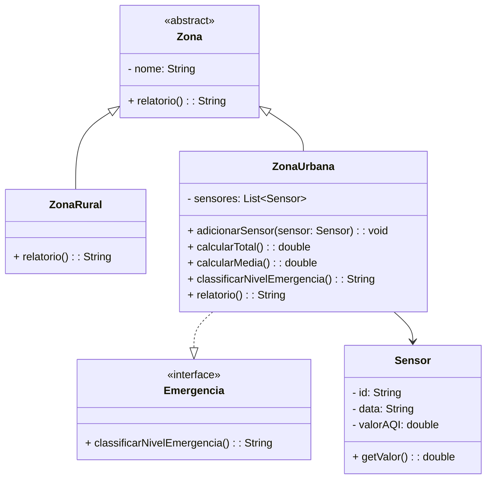

# Sistema de Monitoramento da Qualidade do Ar

Este projeto é parte da Atividade IV da disciplina de Estrutura de Dados, ministrada pelo Prof. Dr. Antonio Marcos Selmini. O sistema simula o monitoramento da qualidade do ar em zonas urbanas e rurais, com base em dados de sensores e classificação de risco ambiental.

## Objetivo

Desenvolver uma aplicação orientada a objetos que:

- Registre zonas de monitoramento (urbana ou rural);
- Associe sensores a zonas urbanas;
- Calcule total e média dos índices AQI (Air Quality Index);
- Classifique o nível de emergência baseado na média semanal;
- Imprima relatórios detalhados para cada zona.

## Funcionalidades

### Zona Rural

- Sem sensores;
- Método `relatorio()` informa que o monitoramento é indireto via satélite.

### Zona Urbana

- Permite adicionar sensores;
- Calcula total e média semanal do AQI;
- Classifica o nível de emergência conforme a média;
- Exibe mensagens de alerta conforme o grau de risco.

### Classe Main

Apresenta um menu com as seguintes opções:

1. Registrar Zona (urbana ou rural);
2. Adicionar Sensor (apenas zonas urbanas);
3. Imprimir Relatório;
4. Finalizar o programa.

Zonas são armazenadas em uma **árvore rubro-negra** usando `TreeSet` com nome como chave.

---

## Diagrama de Classes

